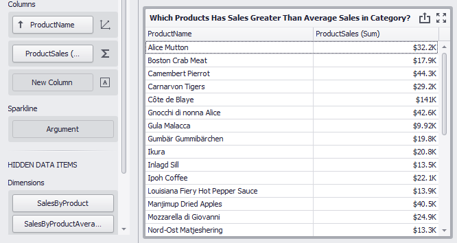

<!-- default badges list -->

[](https://supportcenter.devexpress.com/ticket/details/T950074)
[](https://docs.devexpress.com/GeneralInformation/403183)
<!-- default badges end -->
<!-- default file list -->
*Files to look at*:

* [Form1.cs](./CS/ProductSalesGreaterThanAverage/Form1.cs) (VB: [Form1.vb](./VB/ProductSalesGreaterThanAverage/Form1.vb))
<!-- default file list end -->

# Dashboard for WinForms - How to Display Products with Sales Greater than Average Sales per Category

The example shows how to filter item source data by the aggregated *ProductSales* field and how to display only total sales by products that are greater than the average sales of the entire category.

## Example Structure

The *SalesByProduct* calculated field uses the following function to obtain the total sales by product:

```
aggr(Sum([ProductSales]), [ProductName])
```

The following function determines average product sales per category (the *SalesByProductAverage* calculated field):

```
aggr(Avg([SalesByProduct]), [CategoryName])
```

The created fields are added to the Grid’s hidden dimension section and and the ```[SalesByProduct] > [SalesByProductAverageInCategory]``` expression is set in a [dashboard item filter](https://docs.devexpress.com/Dashboard/116537/common-features/data-shaping/filtering) to see totals only for those products whose sales are greater than the average in the corresponding category.



## Documentation

- [Intermediate Level Aggregations](https://docs.devexpress.com/Dashboard/115870/)
- [Aggregations](https://docs.devexpress.com/Dashboard/115894/)
- [Expression Constants, Operators, and Functions](https://docs.devexpress.com/Dashboard/400122/)

## More Examples

- [Dashboard for WinForms - How to display best and worst monthly sales for each year](https://github.com/DevExpress-Examples/how-to-display-best-and-worst-monthly-sales-for-each-year-t369371)
- [Dashboard for WinForms - How to Calculate the Contribution of Quarterly Sales to Total Yearly Sales](https://github.com/DevExpress-Examples/how-to-calculate-the-contribution-of-quarterly-sales-to-total-yearly-sales)
- [Dashboard for WinForms - How to evaluate a customer acquisition using the quarter/year of their first purchase](https://github.com/DevExpress-Examples/how-to-divide-customers-count-by-the-number-of-orders-they-made-t372356)
- [Dashboard for WinForms - How to divide customers' count by the number of orders they made](https://github.com/DevExpress-Examples/how-to-divide-customers-count-by-the-number-of-orders-they-made-t372356)
- [Dashboard for WinForms - How to calculate Highest Product Sales by Year](https://github.com/DevExpress-Examples/how-to-show-products-with-the-best-sales-in-a-year-along-with-sales-values-t372408)
- [Dashboard for WinForms - How to display sales by years in comparison with the previous year's sales](https://github.com/DevExpress-Examples/win-dashboard-display-previous-year-sales)
- [Dashboard for WinForms - How to Display Product Sales that are Greater than $20k](https://github.com/DevExpress-Examples/How-to-Display-Product-Sales-that-are-Greater-than-20k)
